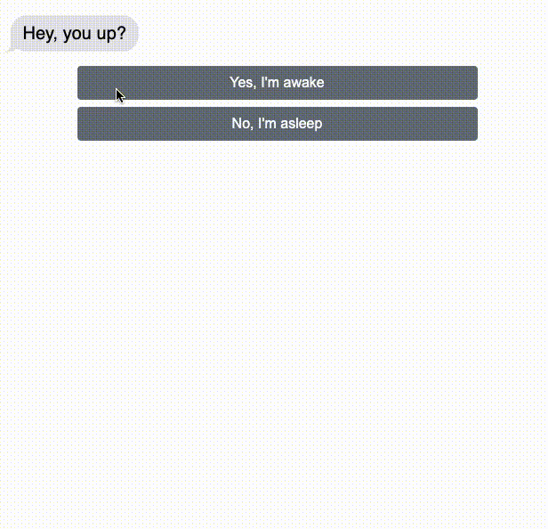

jQuery Texting Adventure
==============

This is a first version of a text chat simulator that can be embedded into a website. You fill out the JSON code creating a decision tree for the user to decide how to respond. You can specify the delay between each response. Requires jQuery 3+



Here is an example of the JSON file:

```javascript
const messagesJSON = [
{
  "id": 10,
  "message": "Hey, you up?",
  "who": "from them",
  "delay": 2,
  "choices": [
    {"option": "Yes, I'm awake", "ifChosenGoTo": 20 },
    {"option": "No, I'm asleep", "ifChosenGoTo": 30 }
  ]
},
{
  "id": 20,
  "message": "Yeah, I'm awake. What do you want?",
  "who": "from me",
  "delay": 2,
  "goto": 40
},
{
  "id": 30,
  "message": "I was sleeping... is it important?",
  "who": "from me",
  "delay": 3,
  "goto": 40
},
{
  "id": 40,
  "message": "I need to tell you something important. I've been dealing with some issues lately and I wanted to get your take.",
  "who": "from them",
  "delay": 2,
  "goto": 50
},
{
  "id": 50,
  "message": "I think I need some help.",
  "who": "from them",
  "delay":2,
  "choices": [
    {"option": "Of course!", "ifChosenGoTo": 60 },
  ]
},
{
  "id": 60,
  "message": "I'm always here for you. What's going on?",
  "who": "from me",
  "delay": 2,
  "goto": 70
},
{
  "id": 70,
  "message": "I'm in a dangerous situation.",
  "who": "from them",
  "delay": 2,
  "goto": 80
},
{
  "id": 80,
  "choices": [
    {"option": "I'm not sure what to say"},
    {"option": "I'm here to help you!"}
  ]
}
];


//activate
$("#holder").textingAdventure(messagesJSON);
```

